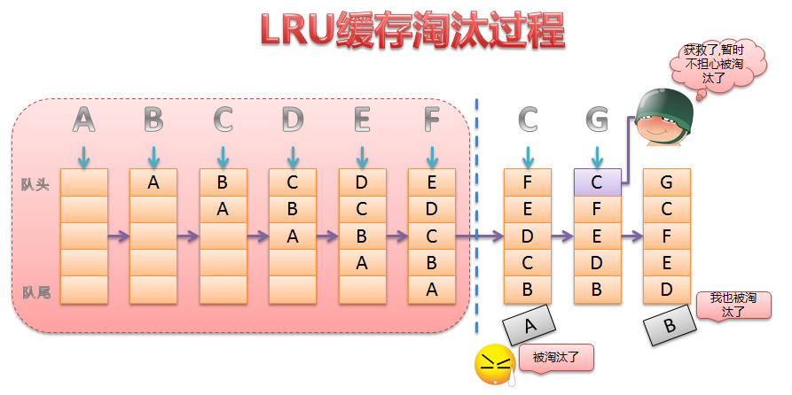

# 流程梳理

缓存只需要两个公共接口：

```c++
void put(Key key, Value value)

std::optional<Value> get(Key key)
```


## LRU



查询缓存，如果缓存节点存在，更新缓存节点到链表头部

添加缓存可能触发淘汰缓存，只需从链表尾部淘汰一个缓存节点

&nbsp;

```c++
template<typename Key, typename Value>
class LruNode {
  friend class LRU<Key, Value>;
  friend class LRUCache<Key, Value>;
 public:
  LruNode(Key key, Value value)
	  : key_(key), value_(value), prev_(nullptr), next_(nullptr) {}

  ~LruNode() {
	  prev_ = nullptr;
	  next_ = nullptr;
  }

 private:
  Key key_;
  Value value_;
  std::shared_ptr<LruNode<Key, Value>> prev_;
  std::shared_ptr<LruNode<Key, Value>> next_;
};
```

定义一个缓存节点，明显看得出后面会用双向链表将这些节点连接起来，并没有选择 list 容器。

这些基础操作的实现，是在 LRU 类中完成。核心点先创建两个虚拟节点，即虚拟头节点和虚拟尾节点，方便操作链表。

删除和添加都是 O(1) 时间复杂度，即 put 操作。get 查询操作如何保证 O(1) 时间复杂度？

通过 unordered_map ，其底层是哈希表，查询的时间复杂度是 O(1)。

&nbsp;

LRU每次查询，就会把缓存更新到头结点，但是这样真的恰当吗？可能这个缓存节点并不会是一个热点数据，只是暂时被访问过一次，甚至后面都不会被访问了。

K-LRU 是一种优化方案，记录一个缓存节点被访问的次数，达到一定的次数才允许加入到实际的缓存中记录，否则只是暂时放在等待链表或历史链表中。

```c++
template<typename Key, typename Value>
class KLru : public LRU<Key, Value> {
  using waitMap = std::unordered_map<Key, std::pair<Value, size_t>>;
 public:
  explicit KLru(size_t capacity, size_t k)
	  : LRU<Key, Value>(capacity), k_(k) {}

  ~KLru() = default;

  std::optional<Value> get(Key key) {
	  auto it = waitList.find(key);
	  if (it != waitList.end()) {
		  it->second.second++;
		  if (it->second.second >= k_) {
			  LRU<Key, Value>::put(key, it->second.first);
			  waitList.erase(it);
		  }
	  }
	  return LRU<Key, Value>::get(key);
  }

  void put(Key key, Value value) {
	  if (LRU<Key,Value>::get(key) != std::nullopt) {
		  LRU<Key, Value>::put(key, value);
		  return;
	  }

	  auto it = waitList.find(key);
	  if (it != waitList.end()) {
		  it->second.first = value;
		  it->second.second++;
		  if (it->second.second >= k_) {
			  LRU<Key, Value>::put(key, value);
			  waitList.erase(it);
		  }
	  } else {
		  waitList[key] = std::make_pair(value, 1);
	  }
  }

 private:
  size_t k_;
  waitMap waitList;
};
```

加入的缓存，暂时先不会加入到 LRU缓存，会暂时放在 waitList 中观察，等超过一定次数，才会加入到 LRU缓存。

因此，我们实际 get 缓存，只能从 LRU 中找，没有就是没有，与 waitList  无关。

## LFU


相较于 LRU，LFU 会选择淘汰最小访问频率或次数的缓存节点，保证热点数据存活。

其中最关键的就是 minFreq_ 的更新，必须保证其正确性：

在 put 新节点的时候，会更新 minFreq_ 为 1。

```c++
  void putNode(Key key, Value value) {
	  // 判断缓存是否已满
	  if (nodeMap_.size() == capacity_) {
		  removeMinFreqNode();
	  }
	  NodePtr node = std::make_shared<NodeType>(key, value);
	  nodeMap_[key] = node;
	  addToFreqList(node);
	  addFreqNum();
	  minFreq_ = 1;
  }
```

访问 缓存节点，会增加频率，就会从之前旧频率链表中移除，可能导致旧频率链表为空，且如果 minFreq_  刚好等于 旧频率，就得更新 minFreq_ 。

```c++
  void updateNode(NodePtr node) {
	  // 频率更新，从当前频率链表中移除，并加入新的频率链表
	  removeFromFreqList(node);
	  node->count_++;
	  addToFreqList(node);

	  // 由于有从某个频率的链表中删除节点，可能导致链表为空
	  // 有可能导致最小频率的链表为空，需要更新最小频率
	  auto prevCount = node->count_ - 1;
	  if (prevCount == minFreq_ && freqToFreqList_[prevCount]->isEmpty()) {
		  minFreq_++;
	  }
  }
```

还有就是，我们会设置一个 最大平均访问频次，如果超过它，我们会考虑对所有频率减半处理，更新节点的存储情况。这个时候，我们也会更新 minFreq_ 。在正常的 LFU 设计中倒是没有这种考虑，但是如果不限制频率大小的话，会导致 unordered_map 存储更多的信息，这也是没有必要的。

```c++
  void updateMinFreq() {
	  minFreq_ = INT8_MAX;
	  for (const auto &freqItm : freqToFreqList_) {
		  if (freqItm.second && !freqItm.second->isEmpty()) {
			  minFreq_ = std::min(minFreq_, freqItm.first);
		  }
	  }
	  if (minFreq_ == INT8_MAX) {
		  minFreq_ = 1;
	  }
  }
```

## LFUCache 和 LRUCache

文章推荐：[多级缓存](https://xiaoyangst.github.io/posts/6139a6a3.html#lru%E7%BC%93%E5%AD%98%E8%AE%BE%E8%AE%A1)

读完此文，想必你就能够看明白 MultiLRU 的设计，那么重点看看 LRUCache（LFUCache 设计与之相同，不重复赘述）。

首先我们会让一个 LRUThread类包含一个 线程 和 一个 MultiLRU。内部是一个生产者-消费者模型，通过 commit 提交回调，即 get 或 put 方法，然后加入到任务队列，唤醒线程去执行任务。

LRUCache 内部是一个线程池，用户可以指定调用哪个 LRUThread 对象的 get 或 put 方法，这般设计是为了在网络编程中，某个用户查询缓存不至于跑到其他缓存中。如果用户随便指定不合法的线程，内部也会通过轮询算法纠正，但这就是随机选择一个缓存服务了，也是用户自找的。

```c++
  void put(Key key, Value value, size_t index) {
	  checkIndex(index);
	  threads_[index]->commit([this, index, key, value]() {
		threads_[index]->put(key, value);
	  });
  }

  std::optional<Value> get(Key key, size_t index) {
	  checkIndex(index);
	  auto future = threads_[index]->commit([this, index, key]() {
		return threads_[index]->get(key);
	  });
	  return future.get();
  }

  void checkIndex(size_t &index) {
	  if (index >= threadNum_) {
		  index = selectThread();
	  }
  }
```

之所以没有加锁，是因为 选择的线程里面是 生产者-消费者模型，且由于任务保存在队列中，不会阻塞，也不会有线程安全问题。

为了保证多个缓存同步，会定时去进行同步，这个时候需要加锁，避免同步期间会再次触发同步，从而出现访问异常。

至于同步期间会不会影响服务的问题，答案是不会影响。首先同步缓存是一个异步操作，再者 MultiLRU 设计的目的就是避免这个无法服务的问题，通过交换内部两个缓存的指针，使得服务不仅可以正常进行，还可以不影响同步缓存操作。

```c++
  void syncCache() {
	  // 防止特别同步时间太短，导致这边还在同步，就把容器交换，并发出现异常
	  std::lock_guard<std::mutex> lock_guard(mtx_);

	  // 收集所有子线程的 pending_ 缓存，合并到主缓存
	  for (const auto &subCache : threads_) {
		  const PNodeMap &pending = subCache->pending();	// 内部有加锁
		  for (const auto &[key, node] : pending) {
			  mainCache_->put(node->key_, node->value_);
		  }
	  }
	  // 保证主缓存的一致性
	  const PNodeMap &cache = mainCache_->pending(false);
	  for (const auto &[key, node] : cache) {
		  std::cout << "syncCache key: " << node->key_ << " value: " << node->value_ << std::endl;
		  for (const auto &subCache : threads_) {
			  subCache->put(node->key_, node->value_);
		  }
	  }
  }
```

## ArcCache


