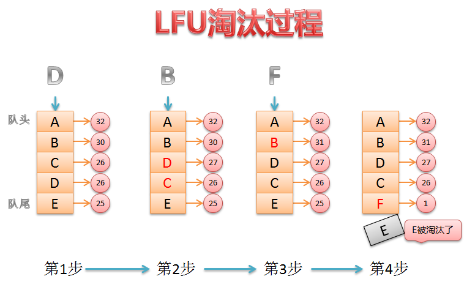

# 流程梳理

缓存只需要两个公共接口：

```c++
void put(Key key, Value value)

std::optional<Value> get(Key key)
```


## LRU


查询缓存，如果缓存节点存在，更新缓存节点到链表头部

添加缓存可能触发淘汰缓存，只需从链表尾部淘汰一个缓存节点

&nbsp;

```c++
template<typename Key, typename Value>
class LruNode {
  friend class LRU<Key, Value>;
  friend class LRUCache<Key, Value>;
 public:
  LruNode(Key key, Value value)
	  : key_(key), value_(value), prev_(nullptr), next_(nullptr) {}

  ~LruNode() {
	  prev_ = nullptr;
	  next_ = nullptr;
  }

 private:
  Key key_;
  Value value_;
  std::shared_ptr<LruNode<Key, Value>> prev_;
  std::shared_ptr<LruNode<Key, Value>> next_;
};
```

定义一个缓存节点，明显看得出后面会用双向链表将这些节点连接起来，并没有选择 list 容器。

这些基础操作的实现，是在 LRU 类中完成。核心点先创建两个虚拟节点，即虚拟头节点和虚拟尾节点，方便操作链表。

删除和添加都是 O(1) 时间复杂度，即 put 操作。get 查询操作如何保证 O(1) 时间复杂度？

通过 unordered_map ，其底层是哈希表，查询的时间复杂度是 O(1)。

&nbsp;

LRU每次查询，就会把缓存更新到头结点，但是这样真的恰当吗？可能这个缓存节点并不会是一个热点数据，只是暂时被访问过一次，甚至后面都不会被访问了。

K-LRU 是一种优化方案，记录一个缓存节点被访问的次数，达到一定的次数才允许加入到实际的缓存中记录，否则只是暂时放在等待链表或历史链表中。

```c++
template<typename Key, typename Value>
class KLru : public LRU<Key, Value> {
  using waitMap = std::unordered_map<Key, std::pair<Value, size_t>>;
 public:
  explicit KLru(size_t capacity, size_t k)
	  : LRU<Key, Value>(capacity), k_(k) {}

  ~KLru() = default;

  std::optional<Value> get(Key key) {
	  auto it = waitList.find(key);
	  if (it != waitList.end()) {
		  it->second.second++;
		  if (it->second.second >= k_) {
			  LRU<Key, Value>::put(key, it->second.first);
			  waitList.erase(it);
		  }
	  }
	  return LRU<Key, Value>::get(key);
  }

  void put(Key key, Value value) {
	  if (LRU<Key,Value>::get(key) != std::nullopt) {
		  LRU<Key, Value>::put(key, value);
		  return;
	  }

	  auto it = waitList.find(key);
	  if (it != waitList.end()) {
		  it->second.first = value;
		  it->second.second++;
		  if (it->second.second >= k_) {
			  LRU<Key, Value>::put(key, value);
			  waitList.erase(it);
		  }
	  } else {
		  waitList[key] = std::make_pair(value, 1);
	  }
  }

 private:
  size_t k_;
  waitMap waitList;
};
```

加入的缓存，暂时先不会加入到 LRU缓存，会暂时放在 waitList 中观察，等超过一定次数，才会加入到 LRU缓存。

因此，我们实际 get 缓存，只能从 LRU 中找，没有就是没有，与 waitList  无关。

## LFU



相较于 LRU，LFU 会选择淘汰最小访问频率或次数的缓存节点，保证热点数据存活。

其中最关键的就是 minFreq_ 的更新，必须保证其正确性：

在 put 新节点的时候，会更新 minFreq_ 为 1。

```c++
  void putNode(Key key, Value value) {
	  // 判断缓存是否已满
	  if (nodeMap_.size() == capacity_) {
		  removeMinFreqNode();
	  }
	  NodePtr node = std::make_shared<NodeType>(key, value);
	  nodeMap_[key] = node;
	  addToFreqList(node);
	  addFreqNum();
	  minFreq_ = 1;
  }
```

访问 缓存节点，会增加频率，就会从之前旧频率链表中移除，可能导致旧频率链表为空，且如果 minFreq_  刚好等于 旧频率，就得更新 minFreq_ 。

```c++
  void updateNode(NodePtr node) {
	  // 频率更新，从当前频率链表中移除，并加入新的频率链表
	  removeFromFreqList(node);
	  node->count_++;
	  addToFreqList(node);

	  // 由于有从某个频率的链表中删除节点，可能导致链表为空
	  // 有可能导致最小频率的链表为空，需要更新最小频率
	  auto prevCount = node->count_ - 1;
	  if (prevCount == minFreq_ && freqToFreqList_[prevCount]->isEmpty()) {
		  minFreq_++;
	  }
  }
```

还有就是，我们会设置一个 最大平均访问频次，如果超过它，我们会考虑对所有频率减半处理，更新节点的存储情况。这个时候，我们也会更新 minFreq_ 。在正常的 LFU 设计中倒是没有这种考虑，但是如果不限制频率大小的话，会导致 unordered_map 存储更多的信息，这也是没有必要的。

```c++
  void updateMinFreq() {
	  minFreq_ = INT8_MAX;
	  for (const auto &freqItm : freqToFreqList_) {
		  if (freqItm.second && !freqItm.second->isEmpty()) {
			  minFreq_ = std::min(minFreq_, freqItm.first);
		  }
	  }
	  if (minFreq_ == INT8_MAX) {
		  minFreq_ = 1;
	  }
  }
```

## LFUCache 和 LRUCache

文章推荐：[多级缓存](https://xiaoyangst.github.io/posts/6139a6a3.html#lru%E7%BC%93%E5%AD%98%E8%AE%BE%E8%AE%A1)

读完此文，想必你就能够看明白 MultiLRU 的设计，那么重点看看 LRUCache（LFUCache 设计与之相同，不重复赘述）。

首先我们会让一个 LRUThread类包含一个 线程 和 一个 MultiLRU。内部是一个生产者-消费者模型，通过 commit 提交回调，即 get 或 put 方法，然后加入到任务队列，唤醒线程去执行任务。

LRUCache 内部是一个线程池，用户可以指定调用哪个 LRUThread 对象的 get 或 put 方法，这般设计是为了在网络编程中，某个用户查询缓存不至于跑到其他缓存中。如果用户随便指定不合法的线程，内部也会通过轮询算法纠正，但这就是随机选择一个缓存服务了，也是用户自找的。

```c++
  void put(Key key, Value value, size_t index) {
	  checkIndex(index);
	  threads_[index]->commit([this, index, key, value]() {
		threads_[index]->put(key, value);
	  });
  }

  std::optional<Value> get(Key key, size_t index) {
	  checkIndex(index);
	  auto future = threads_[index]->commit([this, index, key]() {
		return threads_[index]->get(key);
	  });
	  return future.get();
  }

  void checkIndex(size_t &index) {
	  if (index >= threadNum_) {
		  index = selectThread();
	  }
  }
```

之所以没有加锁，是因为 选择的线程里面是 生产者-消费者模型，且由于任务保存在队列中，不会阻塞，也不会有线程安全问题。

为了保证多个缓存同步，会定时去进行同步，这个时候需要加锁，避免同步期间会再次触发同步，从而出现访问异常。

至于同步期间会不会影响服务的问题，答案是不会影响。首先同步缓存是一个异步操作，再者 MultiLRU 设计的目的就是避免这个无法服务的问题，通过交换内部两个缓存的指针，使得服务不仅可以正常进行，还可以不影响同步缓存操作。

```c++
  void syncCache() {
	  // 防止特别同步时间太短，导致这边还在同步，就把容器交换，并发出现异常
	  std::lock_guard<std::mutex> lock_guard(mtx_);

	  // 收集所有子线程的 pending_ 缓存，合并到主缓存
	  for (const auto &subCache : threads_) {
		  const PNodeMap &pending = subCache->pending();	// 内部有加锁
		  for (const auto &[key, node] : pending) {
			  mainCache_->put(node->key_, node->value_);
		  }
	  }
	  // 保证主缓存的一致性
	  const PNodeMap &cache = mainCache_->pending(false);
	  for (const auto &[key, node] : cache) {
		  std::cout << "syncCache key: " << node->key_ << " value: " << node->value_ << std::endl;
		  for (const auto &subCache : threads_) {
			  subCache->put(node->key_, node->value_);
		  }
	  }
  }
```

## ArcCache

### LFU 和 LRU缺点分析

| 缓存算法 | 主要问题                                                     | 适用场景                                    |
| -------- | ------------------------------------------------------------ | ------------------------------------------- |
| **LFU**  | 旧数据不易淘汰（老化）、新数据容易被淘汰（冷启动）、计算复杂度高 | 适合 **稳定的热点数据**（如数据库索引缓存） |
| **LRU**  | 短期热点数据占据缓存，无法区分访问频率                       | 适合 **短期访问模式**（如 Web 缓存）        |

**综合考虑**，ARC 结合了 **LRU 和 LFU** 的优点，能够动态适应访问模式，因此比单独的 LRU 或 LFU 更优秀。

###  ARC算法思想

ARC算法的动态分配内存的思想是，在输入重复数据较多时，LFU区域长度增加，存储更多的高频词汇内容；而在多次输入不同的数据时，LRU内存区域增加，存储最近使用内容增多。这样就可以实现内存的动态分配了。

为了判断目前的输入方法更倾向于输入不同的数据还是频繁输入相同数据，我们可以对LRU区域和LFU区域分别建立一个淘汰链表，分别存储 LRU 和 LFU 中被淘汰的元素。

### 动态分配思路

每一次在输入数据时，先检查两个淘汰链表中是否有对应的数据：

如果数据在 LRU 淘汰链表中，说明目前访问元素的方法更接近于访问陌生元素。 此时就会扩大 LRU 区域的空间并将这个元素放入 LRU 表内。

如果数据在 LFU 淘汰链表中出现，说明目前访问方法更多频繁访问某些元素，此时，我们让 LFU 区域的空间增加而让 LRU 区域减小。

```c++
  bool checkEliminateCaches(Key key) {
	  auto inEliminate = false;
	  if (arcLRU->checkEliminate(key)) {
		  // 说明最近访问的节点（LRU）更重要
		  // 应该尝试扩容 LRU，缩容 LFU
		  if (arcLFU->decreaseCapacity()) {
			  arcLRU->increaseCapacity();
		  }
		  inEliminate = true;
	  } else if (arcLFU->checkEliminate(key)) {
		  // 说明最近访问的节点（LFU）更重要
		  // 应该尝试扩容 LFU，缩容 LRU
		  if (arcLRU->decreaseCapacity()) {
			  arcLFU->increaseCapacity();
		  }
		  inEliminate = true;
	  }

	  return inEliminate;
  }
```

### put 操作

如果 put 的元素在 LRU 的淘汰链表中存在，说明 LRU 缓存被大量访问，导致被淘汰至  LRU 的淘汰链表中：

1. 首先，要对 LRU 进行扩容，对 LFU 进行缩容。
2. 其次，既然再次被访问说明可能是热点数据，应该从 LRU 的淘汰链表中移除，迁移到 LFU 缓存中。

如果 put 的元素在 LFU 的淘汰链表中存在，说明 LFU 缓存被大量访问，导致被淘汰至  LFU 的淘汰链表中：

1. 首先，要对 LFU 进行扩容，对 LRU 进行缩容。
2. 其次，既然再次被访问说明可能是热点数据，应该从 LFU 的淘汰链表中移除，迁移到 LFU 缓存中。

如果 LFU 和 LRU 淘汰链表中都没有，那就直接加入到 LRU 中。表面这是新数据，可能只是临时访问。

```c++
  void put(Key key, Value value) {
	  if (arcLRU->checkEliminate(key)) {
		  if (arcLFU->decreaseCapacity()) {
			  arcLRU->increaseCapacity();
		  }
		  arcLRU->delEliminateNode(key);
		  arcLFU->put(key, value);
	  } else if (arcLFU->checkEliminate(key)) {
		  if (arcLRU->decreaseCapacity()) {
			  arcLFU->increaseCapacity();
		  }
		  arcLFU->delEliminateNode(key);
		  arcLFU->put(key, value);
	  } else {
		  arcLRU->put(key, value);
	  }
  }
```

### get 操作

如果在 LRU 和 LFU 缓存命中，那就返回缓存数据。

如果在 LRU 淘汰链表找到记录，可能要晋升为长期缓存，即迁移到 LFU 缓存中：

1. 首先，要对 LRU 进行扩容，对 LFU 进行缩容。
2. 其次，既然再次被访问说明可能是热点数据，应该从 LRU 的淘汰链表中移除，迁移到 LFU 缓存中。
3. 返回未命中缓存。

如果在 LFU 淘汰链表找到记录，可能需要长期存储，即迁移到 LFU 缓存中：

1. 首先，要对 LFU 进行扩容，对 LRU 进行缩容。
2. 其次，既然再次被访问说明可能是热点数据，应该从 LFU 的淘汰链表中移除，迁移到 LFU 缓存中。
3. 返回未命中缓存。

如果都没有，那就直接返回未命中缓存。

```c++
  std::optional<Value> get(Key key) {
	  if (arcLRU->checkEliminate(key)) {    // 如果在 LRU 淘汰链表
		  if (arcLFU->decreaseCapacity()) {
			  arcLRU->increaseCapacity();
		  }
		  arcLRU->delEliminateNode(key);
	  } else if (arcLFU->checkEliminate(key)) {    // 如果在 LFU 淘汰链表
		  if (arcLRU->decreaseCapacity()) {
			  arcLFU->increaseCapacity();
		  }
		  arcLFU->delEliminateNode(key);
	  }

	  auto shouldTransform = false;
	  auto re = arcLRU->get(key, shouldTransform);
	  if (re != std::nullopt) {
		  if (shouldTransform) {
			  arcLFU->put(key, re.value());
		  }
	  } else {
		  re = arcLFU->get(key);
	  }
	  return re;
  }
```

# 测试

## 基础

LRU-LFU-ArcCache

```c++
=== 缓存测试 1 ===
capacity 100 operations 10000

=== 测试场景1：热点数据访问测试 ===
命中率: 67.43% | 访问耗时: 0.00731792 秒
命中率: 99.21% | 访问耗时: 0.0152188 秒
命中率: 99.89% | 访问耗时: 0.0220076 秒

=== 测试场景2：循环扫描测试 ===
命中率: 50.2%
命中率: 49.87%
命中率: 49.91%

=== 测试场景3：工作负载剧烈变化测试 ===
命中率: 68.01%
命中率: 81.21%
命中率: 78.92%

=== 缓存测试 2 ===
capacity 200 operations 20000

=== 测试场景1：热点数据访问测试 ===
命中率: 66.98% | 访问耗时: 0.0145333 秒
命中率: 99.525% | 访问耗时: 0.0298758 秒
命中率: 99.985% | 访问耗时: 0.0440167 秒

=== 测试场景2：循环扫描测试 ===
命中率: 59.605%
命中率: 59.59%
命中率: 59.94%

=== 测试场景3：工作负载剧烈变化测试 ===
命中率: 80.58%
命中率: 81.53%
命中率: 92.0333%

=== 缓存测试 3 ===
capacity 500 operations 50000

=== 测试场景1：热点数据访问测试 ===
命中率: 73.17% | 访问耗时: 0.0396718 秒
命中率: 99.648% | 访问耗时: 0.0812834 秒
命中率: 99.984% | 访问耗时: 0.113972 秒

=== 测试场景2：循环扫描测试 ===
命中率: 49.886%
命中率: 49.97%
命中率: 49.974%

=== 测试场景3：工作负载剧烈变化测试 ===
命中率: 86.252%
命中率: 87.084%
命中率: 96.654%
```

